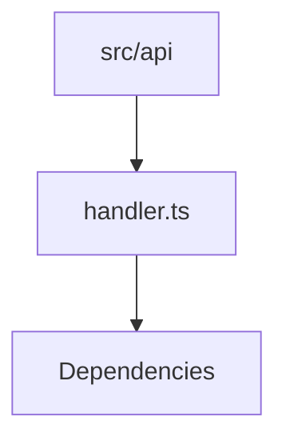

<!-- spine-content-hash:8e6d9d4f5728a450002ad46a1bdb9ddf4e4ae266e7adfb6a4db56d6d6a837f1e -->
# ArchSpine API Layer Overview

This document provides a high-level summary of the `src/api` directory, outlining its role within the ArchSpine project and the responsibilities of its components, particularly the `handler.ts` module.

## Purpose

This document describes the structural organization and dependency relationships of the API layer in the ArchSpine mirror system. It is intended for developers and AI agents who need to understand how the API layer is structured and how its components relate to each other.

## Key Responsibilities

- Describing the role and structure of the `src/api` directory
- Documenting the `handler.ts` module and its dependency topology

## Out of Scope

- Implementation details of API endpoints
- Specific API request/response formats
- Authentication or authorization logic

## Key Takeaways

- The `src/api` directory serves as the API layer of the ArchSpine project.
- The `handler.ts` module is a key component with documented dependencies.
- The document uses a Mermaid graph to visualize the dependency topology.

## Dependency Topology

The following Mermaid graph visualizes the dependency relationships within the `src/api` directory:

*Note: The actual dependency graph would be more detailed in the full documentation.*