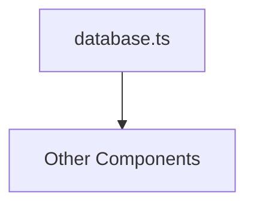

<!-- spine-content-hash:e6c8e411de978e755af3bf89228f1d6a990edfe9285c95b13af7d69b2af0ac75 -->
# ArchSpine Infrastructure Layer (src/infra)

## Purpose
This document describes the infrastructure layer (`src/infra`) of the ArchSpine mirror system, outlining its role, responsibilities, and structural components.

## Context & Audience
Intended for developers and system architects who need to understand the foundational infrastructure modules, particularly the database dependency, within the ArchSpine project.

## Responsibilities
- Defining the infrastructure directory structure and its components
- Documenting the database module (`database.ts`) and its role
- Illustrating dependency topology via Mermaid diagram

## Out of Scope
- Application logic or business rules
- User interface or presentation layer
- Deployment or operational configuration

## Key Takeaways
- The `src/infra` directory serves as the infrastructure layer for the mirror system.
- It currently contains a single documented module: `database.ts`.
- A dependency topology diagram shows the relationship of `database.ts` to other components.

## Dependency Topology
