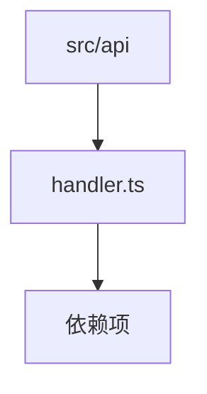

<!-- spine-content-hash:8e6d9d4f5728a450002ad46a1bdb9ddf4e4ae266e7adfb6a4db56d6d6a837f1e -->
# ArchSpine API 层概述

本文档概述了 `src/api` 目录的结构，说明了该目录在 ArchSpine 项目中的角色以及其组件（特别是 `handler.ts` 模块）的职责。

## 目的

本文档描述了 ArchSpine 镜像系统中 API 层的结构组织和依赖关系。面向需要了解 API 层如何构建及其组件之间关系的开发者和 AI 代理。

## 主要职责

- 描述 `src/api` 目录的角色和结构
- 记录 `handler.ts` 模块及其依赖拓扑

## 不涉及范围

- API 端点的实现细节
- 特定的 API 请求/响应格式
- 身份验证或授权逻辑

## 关键要点

- `src/api` 目录是 ArchSpine 项目的 API 层。
- `handler.ts` 模块是一个关键组件，具有明确的依赖关系。
- 本文档使用 Mermaid 图来可视化依赖拓扑。

## 依赖拓扑

以下 Mermaid 图展示了 `src/api` 目录内的依赖关系：

*注意：完整的文档中会包含更详细的依赖关系图。*