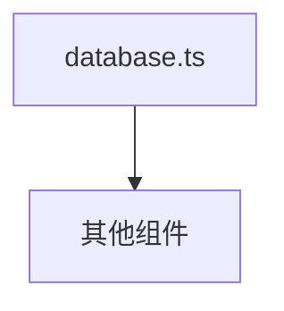

<!-- spine-content-hash:e6c8e411de978e755af3bf89228f1d6a990edfe9285c95b13af7d69b2af0ac75 -->
# ArchSpine 基础设施层（src/infra）

## 目的
本文档描述了 ArchSpine 镜像系统的基础设施层（`src/infra`），阐明了其角色、职责和结构组件。

## 上下文与受众
面向需要了解 ArchSpine 项目中基础基础设施模块（特别是数据库依赖关系）的开发者和系统架构师。

## 职责
- 定义基础设施目录结构及其组件
- 记录数据库模块（`database.ts`）及其作用
- 通过 Mermaid 图展示依赖拓扑

## 范围外
- 应用程序逻辑或业务规则
- 用户界面或表示层
- 部署或运维配置

## 关键要点
- `src/infra` 目录作为镜像系统的基础设施层。
- 当前仅包含一个已记录的模块：`database.ts`。
- 依赖拓扑图展示了 `database.ts` 与其他组件的关系。

## 依赖拓扑
