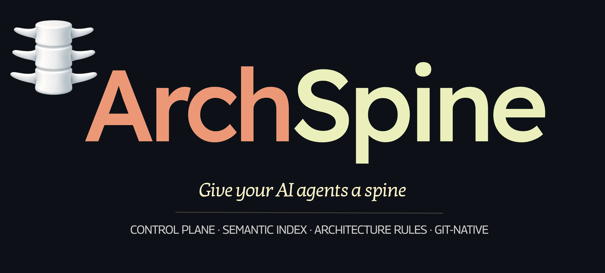
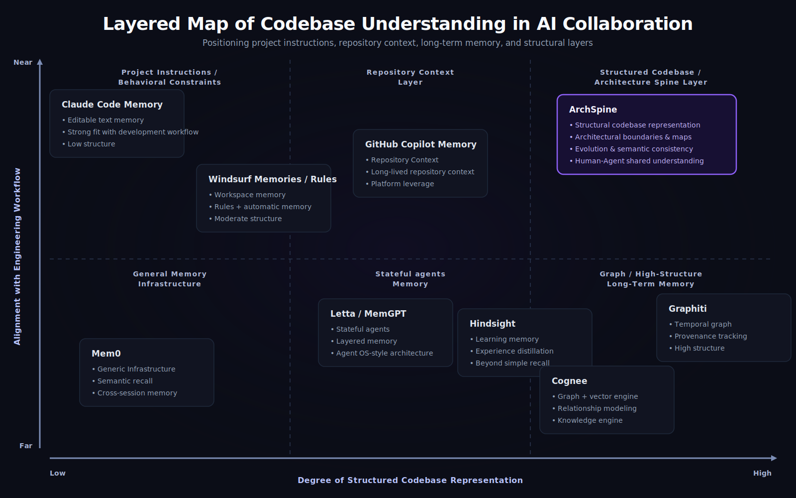

# ArchSpine

<p align="center">
  <!-- Hero image showing an AI Agent using MCP tools to explore a codebase -->
  
</p>
<p align="center">
  English | <a href="./README.zh-CN.md">简体中文</a>
</p>
<p align="center">
  
  
  
  
</p>

**Your AI Agent's Architectural Memory.**

ArchSpine builds a physical `.spine/` control plane inside your Git repository — a machine-readable semantic layer that AI coding assistants query in real time. No more blind agents wrecking your module boundaries.

> 🧠 **MCP-native**: The primary interface is MCP (Model Context Protocol). 21 tools, 3 resource templates, 2 prompt templates. CLI is just the installer.

---

## The Missing Layer in AI Code Understanding

<p align="center">
  
</p>

AI agents need four layers of capability to truly understand a codebase. The first two layers — behavioral instructions (CLAUDE.md, AGENTS.md) and repository context (Copilot Memory, Windsurf Rules) — are well served. The bottom layer — general memory infrastructure (Mem0, Letta, Graphiti) — is a thriving ecosystem.

**But Layer 3 was missing.** A structured, machine-readable, auto-generated architecture layer that bridges raw source code and agent intelligence.

That's ArchSpine. It doesn't replace any layer — it fills the gap between them and the code itself.

---

## The Problem

AI writes code faster than ever. But agents operate without architectural context — they cross layer boundaries, create circular dependencies, and silently accumulate **invisible technical debt**.

Prompt files advise. RAG suggests. Neither **enforces**.

Traditional tools (linters, formatters) catch syntax but miss semantics. A missing import is an error; a cross-layer call is "just code."

## The Solution

ArchSpine gives AI agents a **structured control plane** they can read and reason about:

- **Semantic Baseline** — Consolidates real architectural boundaries and module responsibilities into a queryable index.
- **Semantic Change Tracking** — Tracks drift at the architecture level, not just line diffs.
- **Semantic Audit** — Checks every change against redlines defined in `.spine/rules/`.

Agents no longer face a pile of discrete source files. They operate within an engineering system with **strict context and clear constraints**.

## Quick Start

```bash
# Prerequisites: Node.js >= 20.18.1
npx --yes archspine@latest init
npx --yes archspine@latest scan --quick     # 30 seconds, zero LLM cost
npx --yes archspine@latest sync             # Full semantic sync
```

- `init` bootstraps `.spine/` config, rules, and documentation languages
- `scan --quick` runs AST-only analysis across 10 languages — no LLM key needed
- `sync` (with LLM configured) produces the full semantic index

<!-- Terminal demo GIF: `spine init && spine scan --quick` in action (30s) -->

## MCP Integration — The Primary Interface

ArchSpine is designed as a **MCP-native product**. The CLI is just the setup tool; the real power lives in MCP.

### Quick Setup

```bash
spine mcp setup     # One-command: detects your IDE, writes config
spine mcp start     # Starts the MCP STDIO server
```

### MCP Tools (21 tools)

| Category    | Tools                                                                                                                                                     |
| ----------- | --------------------------------------------------------------------------------------------------------------------------------------------------------- |
| **Query**   | `spine_query_invariants`, `spine_query_responsibilities`, `spine_search_symbols`, `spine_match_semantic`, `spine_query_graph`, `spine_get_module_context` |
| **Context** | `spine_get_file_context`, `spine_get_change_impact`, `spine_get_drift_history`, `spine_get_semantic_diff`                                                 |
| **Status**  | `spine_get_sync_status`, `spine_get_baseline_status`, `spine_get_violations_summary`, `spine_get_diagnostics`, `spine_get_config`                         |
| **Views**   | `spine_get_view_data`, `spine_list_resource_templates`, `spine_preview_scan`                                                                              |
| **Actions** | `spine_run_scan`, `spine_run_sync`, `spine_check_operation`                                                                                               |

### MCP Resources

| URI                        | Description                                                                                                                   |
| -------------------------- | ----------------------------------------------------------------------------------------------------------------------------- |
| `spine://project`          | Project-level metadata and configuration                                                                                      |
| `spine://folder/{dirPath}` | Semantic profile of a directory                                                                                               |
| `spine://file/{filePath}`  | Semantic context of an individual file                                                                                        |
| `spine://view/{viewType}`  | One of 6 generated views (risk-hotspots, public-surface, architecture-diagram, project-health, agent-briefing, change-impact) |

### MCP Prompts

| Prompt                                                    | Purpose                                               |
| --------------------------------------------------------- | ----------------------------------------------------- |
| `architectural_context(filePath)`                         | Guides Agent to gather context before modifying files |
| `pre_write_checklist(filePath, operation, importTarget?)` | Standardized safety checklist for write operations    |

> Full reference: [docs/reference/mcp-tools.md](./docs/reference/mcp-tools.md)

### IDE Configuration

<details>
<summary>Claude Desktop</summary>

```json
{
  "mcpServers": {
    "archspine": {
      "command": "node",
      "args": ["/path/to/archspine/dist/cli/index.js", "mcp", "start"]
    }
  }
}
```

</details>

<details>
<summary>Claude Code</summary>

```bash
claude mcp add archspine node /path/to/archspine/dist/cli/index.js mcp start
```

</details>

<details>
<summary>Cursor</summary>

Add a stdio server in `Settings -> Features -> MCP` pointing to the same command.

</details>

## Features

- **Knowledge Graph** — Module-level dependency graph with fan-in/out, violation tracking, and semantic search.
- **Diagnostics Engine** — Automatic detection of dependency cycles, dead code, and over-coupled hub modules.
- **Architecture Rules** — Define redlines in `.spine/rules/`. Audit with `spine check`.
- **Agent Briefing** — One-page project overview generated for AI agents on every sync.
- **6 Deterministic Views** — Risk hotspots, public surface, architecture diagram, project health, agent briefing, change impact. Zero LLM cost — pure logic computation.
- **Quick Scan (AST-only)** — 10 languages, ~30 seconds, no LLM needed. Perfect for CI gating.
- **Semantic Diff** — Compare two files or commits at the architecture level.

## Dogfooding — We Use What We Build

ArchSpine's own codebase is governed by ArchSpine. Every `spine build` generates a complete semantic index of **our own code** — 200+ file summaries, a knowledge graph of real module dependencies, architecture rules with live violation tracking. This repository's `.spine/` directory is not a demo; it's our daily driver.

| Metric                        | Value                             |
| ----------------------------- | --------------------------------- |
| Codebase                      | ~350 files, ~29k lines TypeScript |
| Full baseline (`spine build`) | ~25 min                           |
| Input tokens                  | 10.4M                             |
| Output tokens                 | 0.85M                             |
| Model                         | DeepSeek V4 Flash                 |
| Quick scan (no LLM)           | **~30s**                          |

<!-- Bar chart comparing ArchSpine build costs vs. alternative approaches -->

## Mental Model

As the diagram above shows, ArchSpine occupies the **Structured Architecture Layer** — between raw source code and AI agents. It provides the same function to AI that architectural diagrams provide to humans: a compressible, queryable map of what exists and what is allowed.

## CLI Reference

ArchSpine's CLI is intentionally minimal. Most operations happen via MCP.

| Command     | Purpose                                  |
| ----------- | ---------------------------------------- |
| `init`      | Initialize `.spine/` in the current repo |
| `sync`      | Incremental semantic sync                |
| `check`     | Audit project against architecture rules |
| `build`     | Full rebuild of semantic mirror baseline |
| `mcp setup` | Configure MCP for your IDE               |
| `mcp start` | Start MCP server                         |
| `info`      | Show workspace configuration and status  |
| `view`      | Manage and generate views                |
| `config`    | Read/write configuration                 |
| `llm`       | Manage LLM provider settings             |
| `rules`     | Pre-load architecture rule templates     |

Full guide: [docs/reference/cli.md](./docs/reference/cli.md)

## Roadmap

- **v1.0 (Current)**: Knowledge Graph, diagnostics engine, deterministic SVG architecture diagram, agent briefing, 6 MCP views, Claude Code skill, CI templates.
- **v2.1+**: Pluggable View Ecosystem — community-extensible analysis views via declarative `.md` templates, partial context loading for monorepos, MCP→view feedback loop.

## Community

[](https://discord.gg/RjfSVKfRzH)
[](https://jq.qq.com/?_wv=1027&k=RjfSVKfRzH)

## Contributing

See [CONTRIBUTING.md](./CONTRIBUTING.md). Participation is governed by our [Code of Conduct](./CODE_OF_CONDUCT.md).

## License

Licensed under [Apache License 2.0](./LICENSE).
