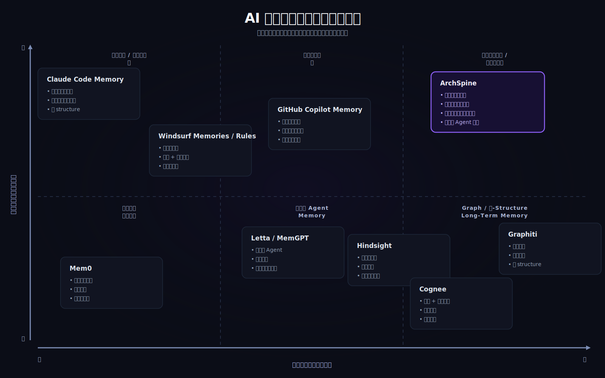

# ArchSpine

<p align="center">
  <!-- Agent 通过 MCP 工具探索代码库的 GIF 演示 -->
  
</p>
<p align="center">
  <a href="./README.md">English</a> | 简体中文
</p>
<p align="center">
  
  
  
  
</p>

**AI Agent 的架构记忆体。**

ArchSpine 在你的 Git 仓库中建立了一个实体的 `.spine/` 控制面——一套机器可读的语义层，AI 编程助手可以实时查询。从此让你的 Agent 不再搞乱你的架构边界。

> 🧠 **MCP 原生**：主要交互界面是 MCP（Model Context Protocol）。提供 21 个工具、3 个资源模板、2 个提示词模板。CLI 只是安装器。

---

## AI Agent 理解代码仓库缺失的那一层

<p align="center">
  
</p>

AI Agent 需要四层能力才能真正理解一个代码仓库。第一层——行为指令（CLAUDE.md、AGENTS.md）和第二层——仓库上下文（Copilot Memory、Windsurf Rules）已有成熟方案。第四层——通用记忆基础设施（Mem0、Letta、Graphiti）——也是一个蓬勃发展的生态。

**但第三层一直缺失。** 一层结构化的、机器可读的、自动生成的架构层，将原始源码与 AI 智能连接起来。

这就是 ArchSpine。它不替代任何一层——而是填补了它们与代码之间的空缺。

---

## 为什么要用 ArchSpine

AI 写代码越来越快，但 Agent 缺少架构上下文——它们跨层调用、制造循环依赖、悄悄积累**不可见的技术债**。

提示词文件是"建议"。RAG 也是"建议"。Agent 读了之后仍然可以忽略。

ArchSpine 的回答是：**在本地建立一套实体的语义基线**。这不是文档，而是机器可验证的控制面。Agent 动手之前能读到职责边界和红线规则；人类合并之前能审计架构漂移。

## 三大核心机制

- **语义基线（Baseline）— 债的盘点**：梳理代码库当前的真实架构边界与模块职责，建立全仓上下文基准。
- **语义变更追踪 — 债的预警**：不仅追踪行级 Diff，更持续追踪架构维度的语义漂移。
- **语义审查（Audit）— 债的拦截**：结合 `.spine/rules/` 中的红线规则，对越界行为进行自动拦截。

## 30 秒快速开始

```bash
# 前提：Node.js >= 20.18.1
npx --yes archspine@latest init
npx --yes archspine@latest scan --quick     # 30 秒完成，零 LLM 开销
npx --yes archspine@latest sync             # 完整语义同步
```

- `init` 引导初始化 `.spine/` 配置、规则和文档语言
- `scan --quick` 纯 AST 分析（10 种语言），无需 LLM 密钥
- `sync`（配置 LLM 后）生成完整语义索引

<!-- `spine init && spine scan --quick` 的终端演示 GIF -->

## MCP 集成 — 主要交互界面

ArchSpine 是一个 **MCP 原生产品**。CLI 只是安装工具，真正的能力在 MCP。

### 快速配置

```bash
spine mcp setup     # 一键配置：自动检测 IDE，写入配置
spine mcp start     # 启动 MCP STDIO 服务
```

### MCP 工具（21 个）

| 分类       | 工具                                                                                                                                                      |
| ---------- | --------------------------------------------------------------------------------------------------------------------------------------------------------- |
| **查询**   | `spine_query_invariants`, `spine_query_responsibilities`, `spine_search_symbols`, `spine_match_semantic`, `spine_query_graph`, `spine_get_module_context` |
| **上下文** | `spine_get_file_context`, `spine_get_change_impact`, `spine_get_drift_history`, `spine_get_semantic_diff`                                                 |
| **状态**   | `spine_get_sync_status`, `spine_get_baseline_status`, `spine_get_violations_summary`, `spine_get_diagnostics`, `spine_get_config`                         |
| **视图**   | `spine_get_view_data`, `spine_list_resource_templates`, `spine_preview_scan`                                                                              |
| **操作**   | `spine_run_scan`, `spine_run_sync`, `spine_check_operation`                                                                                               |

### MCP 资源

| URI                        | 说明                                                                           |
| -------------------------- | ------------------------------------------------------------------------------ |
| `spine://project`          | 项目级元数据与配置                                                             |
| `spine://folder/{dirPath}` | 目录语义画像                                                                   |
| `spine://file/{filePath}`  | 单个文件的语义上下文                                                           |
| `spine://view/{viewType}`  | 6 种生成视图之一（风险热点、公开接口、架构图、项目健康、Agent 简报、变更影响） |

### MCP 提示词

| 提示词                                                    | 用途                                |
| --------------------------------------------------------- | ----------------------------------- |
| `architectural_context(filePath)`                         | 引导 Agent 在修改文件前先收集上下文 |
| `pre_write_checklist(filePath, operation, importTarget?)` | 标准化写前安全检查流程              |

> 完整参考：[docs/zh-CN/reference/mcp-tools.md](./docs/zh-CN/reference/mcp-tools.md)

## 功能特性

- **知识图谱** — 模块级依赖图，含 fan-in/out、违规追踪和语义搜索
- **诊断引擎** — 自动检测循环依赖、死代码和过度耦合的枢纽模块
- **架构规则** — 在 `.spine/rules/` 中声明红线，用 `spine check` 审计
- **Agent 简报** — 每次 sync 为 AI Agent 生成单页项目概览
- **6 个确定性视图** — 风险热点、公开接口、架构图、项目健康、Agent 简报、变更影响。零 LLM 开销，纯逻辑计算
- **Quick Scan（AST 纯分析）** — 10 种语言，~30 秒，无需 LLM。适合 CI 门禁
- **语义 Diff** — 在架构层面对比两个文件或提交

## 自举验证 — 我们在用自己的产品

ArchSpine 自己的代码库就在用 ArchSpine 来管理。每次 `spine build` 都会生成我们**自己代码**的完整语义索引——200+ 文件的语义摘要、真实模块依赖的知识图谱、带实时违规追踪的架构规则。这个仓库的 `.spine/` 目录不是演示，是我们的日常工具。

| 指标                          | 数值                          |
| ----------------------------- | ----------------------------- |
| 代码库规模                    | ~350 文件，~29k 行 TypeScript |
| 全量基线构建（`spine build`） | ~25 分钟                      |
| 输入 Tokens                   | 10.4M                         |
| 输出 Tokens                   | 0.85M                         |
| 模型                          | DeepSeek V4 Flash             |
| Quick Scan（无 LLM）          | **~30 秒**                    |

<!-- 柱状图，对比 ArchSpine 构建成本与其他方案 -->

## 心智模型

如上图所示，ArchSpine 占据**结构化架构层**——在源码和 AI Agent 之间。它为 AI 提供与架构图为人类提供的相同功能：一个可压缩、可查询的架构地图。

## CLI 参考

CLI 保持极简。大部分操作通过 MCP 完成。

| 命令        | 用途                       |
| ----------- | -------------------------- |
| `init`      | 在当前仓库初始化 `.spine/` |
| `sync`      | 增量语义同步               |
| `check`     | 按架构规则审计项目         |
| `build`     | 全量重建语义镜像基线       |
| `mcp setup` | 为 IDE 配置 MCP            |
| `mcp start` | 启动 MCP STDIO 服务        |
| `info`      | 查看配置与同步状态         |
| `view`      | 管理视图生成               |
| `config`    | 读写持久化配置             |
| `llm`       | 管理 LLM 提供商设置        |
| `rules`     | 预加载架构规则模板         |

完整说明：[CLI 命令参考](./docs/zh-CN/reference/cli.md)

## 路线图

- **v1.0（当前）**：知识图谱、诊断引擎、确定性 SVG 架构图、Agent 简报、6 个 MCP 视图、Claude Code skill、CI 模板
- **v2.1+**：插件化视图生态——社区通过声明式 `.md` 模板零代码扩展分析视图，单体仓库部分上下文加载，MCP→视图闭环

## 社区

[](https://discord.gg/RjfSVKfRzH)
[](https://jq.qq.com/?_wv=1027&k=RjfSVKfRzH)

## 贡献

修改运行时、规则协议或文档结构前，请先阅读 [CONTRIBUTING.md](./CONTRIBUTING.md)。参与贡献默认遵守 [Code of Conduct](./CODE_OF_CONDUCT.md)。

## License

本项目基于 [Apache License 2.0](./LICENSE) 开源。
